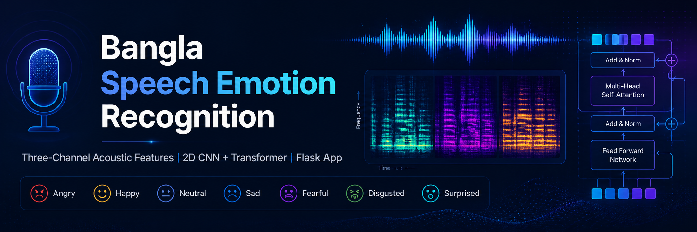
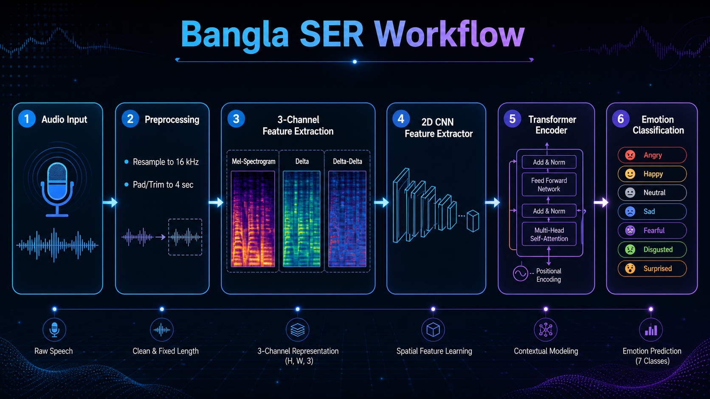

# Bangla Speech Emotion Recognition Using 2D CNN-Transformer

<p align="center">
  
</p>

<p align="center">
  <b>A Flask-based Bangla Speech Emotion Recognition system using three-channel acoustic features and a hybrid 2D CNN-Transformer model.</b>
</p>

---

## Overview

This project implements a **Bangla Speech Emotion Recognition (SER)** web application.  
The system takes Bangla speech audio as input, preprocesses the audio, extracts three-channel acoustic features, and predicts the emotional class using a trained hybrid **2D CNN-Transformer** model.

The three-channel input representation consists of:

- **Mel-spectrogram**
- **Delta**
- **Delta-delta**

The application is built with **Flask** and allows users to upload audio files through a simple web interface.

---

## Workflow

<p align="center">
  
</p>

The overall pipeline follows these steps:

1. Audio input
2. Audio preprocessing
3. Three-channel feature extraction
4. 2D CNN-based local feature learning
5. Transformer-based contextual modeling
6. Emotion classification

---

## Features

- Upload Bangla speech audio through a Flask web interface
- Automatic audio preprocessing
- Mel-spectrogram, Delta, and Delta-delta feature extraction
- Hybrid 2D CNN-Transformer model for emotion prediction
- Seven-class emotion classification
- Supports multiple audio formats
- Lightweight and easy to run locally

---

## Emotion Classes

The model predicts one of the following seven emotion classes:

| Class No. | Emotion |
|---|---|
| 1 | Angry |
| 2 | Disgusted |
| 3 | Fearful |
| 4 | Happy |
| 5 | Neutral |
| 6 | Sad |
| 7 | Surprised |

---

## Project Structure

```text
bangla-ser-2d-cnn-transformer/
│
├── app.py
├── requirements.txt
├── README.md
│
├── bangla_cnn_transformer_emotion.keras
├── bangla_emotion_labels.json
│
├── assets/
│   ├── banner.png
│   └── workflow.png
│
├── templates/
│   └── index.html
│
├── static/
│   └── style.css
│
└── uploads/
```

---

## Required Files

Make sure these files are available in the project directory:

```text
app.py
requirements.txt
bangla_cnn_transformer_emotion.keras
bangla_emotion_labels.json
```

Optional:

```text
ffmpeg/bin
```

Use the local FFmpeg folder only if FFmpeg is not installed globally or not added to your system PATH.

---

## Installation

Clone the repository:

```bash
git clone https://github.com/mostafaasif22/bangla-ser-2d-cnn-transformer.git
```

Go to the project directory:

```bash
cd bangla-ser-2d-cnn-transformer
```

Create a virtual environment:

```bash
python -m venv .venv
```

Activate the virtual environment.

For Windows PowerShell:

```bash
.venv\Scripts\activate
```

Install dependencies:

```bash
pip install -r requirements.txt
```

---

## Run the Application

Start the Flask application:

```bash
python app.py
```

Then open the following address in your browser:

```text
http://127.0.0.1:5000
```

---

## Supported Audio Formats

The application supports the following audio formats:

```text
.wav, .mp3, .m4a, .ogg, .flac, .webm
```

---

## Preprocessing Details

The application follows the same preprocessing pipeline used during model training:

| Step | Value |
|---|---|
| Sampling rate | 16 kHz |
| Duration | 4 seconds |
| Mel bins | 128 |
| Input shape | 128 × 251 × 3 |
| Feature channels | Mel-spectrogram, Delta, Delta-delta |

---

## Model Architecture

The model uses a hybrid deep learning architecture:

- **2D CNN layers** extract local time-frequency acoustic patterns.
- **Transformer encoder layers** model contextual and sequential dependencies.
- **Dense classification layers** produce the final emotion prediction.

The final output layer uses softmax activation for seven-class emotion classification.

---

## Technologies Used

- Python
- Flask
- TensorFlow / Keras
- Librosa
- NumPy
- HTML
- CSS
- FFmpeg

---

## Important Notes

- Do not upload the `.venv` folder to GitHub.
- Do not upload large dataset or audio files unless required.
- Do not upload unnecessary ZIP files.
- If the trained model file is larger than GitHub's file size limit, use Git LFS.
- Keep only source code, configuration files, images, and documentation in the repository.

---

## Author

**Sheikh Mostafa Asif Shafaat**  
Department of Computer Science & Engineering  
University of Liberal Arts Bangladesh

---

## Repository

[Bangla SER 2D CNN-Transformer](https://github.com/mostafaasif22/bangla-ser-2d-cnn-transformer)
